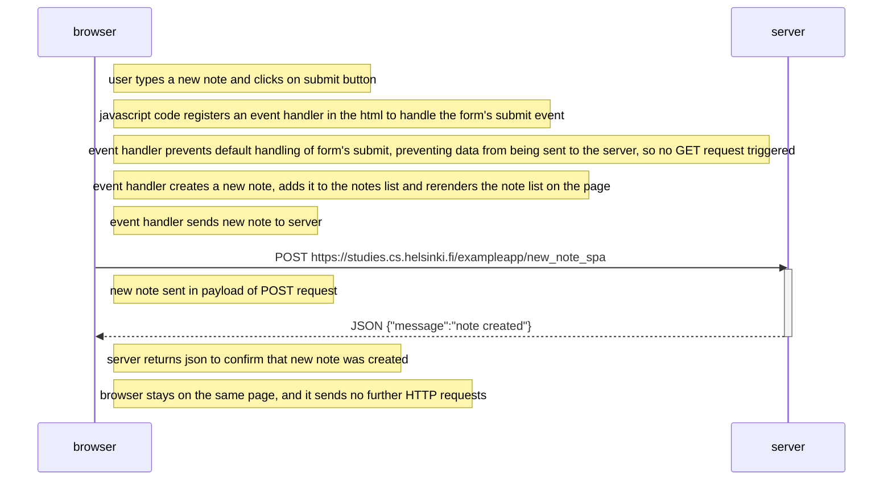

```mermaid
sequenceDiagram
    participant browser
    participant server

    Note right of browser: user types a new note and clicks on submit button

    Note right of browser: javascript code registers an event handler in the html to handle the form's submit event

    Note right of browser: event handler prevents default handling of form's submit, preventing data from being sent to the server, so no GET request triggered

    Note right of browser: event handler creates a new note, adds it to the notes list and rerenders the note list on the page

    Note right of browser: event handler sends new note to server

    browser->>server: POST https://studies.cs.helsinki.fi/exampleapp/new_note_spa
    activate server

    Note right of browser: new note sent in payload of POST request

    server-->>browser: JSON {"message":"note created"}
    deactivate server

    Note right of browser: server returns json to confirm that new note was created
    Note right of browser: browser stays on the same page, and it sends no further HTTP requests
```
